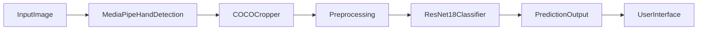

# CSCI4055 - NLP

## Proposal/Project Specifications
[Link to proposal](https://github.com/Megadast/CSCI4050-machine-learning/blob/main/Documents/Project%20Proposal.pdf)

## Project Submission and details page
[Link to proposal](https://docs.google.com/document/d/1fHhpxRTeGKunU2NyJhxFJ5Jxy0uY3lJdPAncQGu8nMs/edit?tab=t.0)

## Table of Contents
[Table of Contents](#table-of-contents)   
[List of Figures](#list-of-figures)

- [1.0 Design Proposal](#10-design-proposal)
  - [1.1 Project Requirements and Specifications](#11-project-requirements-and-specifications)
- [2.0 Libraries Required](#20-libraries-required)
- [3.0 Dataset(s)](#30-datasets)
- [4.0 Integration](#40-integration)
  - [4.1 Phase One](#41-phase-one)
  - [4.2 Phase Two](#42-phase-two)
  - [4.3 Phase Three](#43-phase-three)
- [5.0 Acronyms](#50-acronyms)
- [6.0 How to Run](#60-how-to-run)
- [7.0 References](#70-references)

## List of Figures   
[Figure 1 Final Output](#figure-1-final-output)

[Figure 2 Real Annotated](#figure-2-real-annotated)

### 1.0 Design proposal
This project 
<br>

<b>Design Approach (For now)</b>


  
### 1.1 Project Requirements and Specifications   
- Implement

## 2.0 Libraries Required <br>

### 2.1 PyTorch <br>
Model training and inference

### 2.6 python-dotenv <br>
Roboflow API credential loading

### 3.0 Dataset
stuff:  <br>
Offers

### 3.1 Model Class List (47 total) <br>
asdasfasf <br>

## 4.0 Integration 

### 4.1 Phase One
- Implemented automatic Roboflow dataset download / extraction

### 4.2 Phase Two
- Added predict.py to evaluate any image or folder of images

### 4.3 Phase Three - Project Submission
- Code restructuring

## 5.0 Acronyms
ML — Machine Learning <br>
CNN — Convolutional Neural Network <br>

## 6.0 How to Run

### Prerequisites
- Python 3.8 or higher
- pip package manager

### Installation and Execution

Install required dependencies:
```bash
pip install -r requirements.txt
```

Run the complete pipeline:
```bash
python main.py
```

### Output Sample
**Final Output**
safsadfsda

## 7.0 References
PyTorch Documentation:
https://pytorch.org <br>
